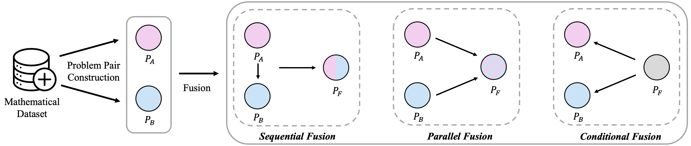
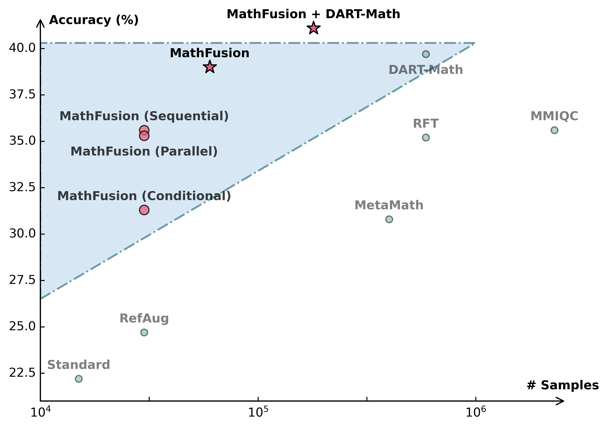

<p align="center">
<h1 align="center">MathFusion: Enhancing Mathematic Problem-solving of LLM through Instruction Fusion</h1>

<p align="center">
    <a href="https://arxiv.org/abs/xxx"></a>
    <a href="https://github.com/QizhiPei/MathFusion/blob/main/LICENSE"></a>
    <a href="https://huggingface.co/collections/QizhiPei/mathfusion-67d92b8e505635db1baf20bb"></a>
</p>

We introduce MathFusion, a novel framework that enhances mathematical reasoning through cross-problem instruction synthesis. MathFusion implements this through three fusion strategies:
1. **Sequential Fusion**, which chains related problems to model solution dependencies.
2. **Parallel Fusion**, which combines analogous problems to reinforce conceptual understanding.
3. **Conditional Fusion**, which creates context-aware selective problems to enhance reasoning flexibility.



MathFusion achieves substantial improvements in mathematical reasoning while maintaining hight data efficiency, boosting performance by 18.0 points in accuracy across diverse benchmarks while requiring **only 45K additional synthetic instructions**. Further combination of MathFusion and DART-Math yields SOTA performance



We release the MathFusionQA dataset and three MathFusion models fine-tuned on this dataset.

| Dataset/Model | MATH | CollegeMath | DeepMind-Mathematics | HuggingFace🤗 |
| - | :-: | :-: | :-: | :-: |
| MathFusionQA | - | - | - | [link](https://huggingface.co/datasets/QizhiPei/MathFusionQA) |
| DeepSeekMath-7B-MathFusion | 53.4 | 39.8 | 65.8 | [link](https://huggingface.co/QizhiPei/DeepSeekMath-7B-MathFusion) |
| Mistral-7B-MathFusion | 41.6 | 24.3 | 39.2 | [link](https://huggingface.co/QizhiPei/Mistral-7B-MathFusion) |
| Llama3-8B-MathFusion | 46.5 | 27.9 | 43.4 | [link](https://huggingface.co/QizhiPei/Llama3-8B-MathFusion) |

## 🎯 Quick Start
Install the dependencies:

```bash
conda create -n mathfusion python=3.10
conda activate mathfusion
# Install Pytorch according to your CUDA version
pip install torch==2.3.1 torchvision==0.18.1 torchaudio==2.3.1 --index-url https://download.pytorch.org/whl/cu121
# Install LLaMA-Factory
git clone https://github.com/hiyouga/LLaMA-Factory.git
cd LLaMA-Factory
git checkout v0.9.1
pip install transformers==4.46.1 accelerate==0.34.2 deepspeed==0.15.4
pip install -e ".[torch,metrics]"
# Install packages for evaluation
pip install flash-attn==2.7.3 --no-build-isolation
pip install sympy==1.12.1 antlr4-python3-runtime==4.11.1 pebble word2number boto3 triton==2.3.1
pip install vllm==0.5.3.post1
# Install latex2sympy
cd ../evaluation/latex2sympy
pip install -e .
cd ..
# Install dart-math evaluation
pip install -e .
```

## 📚 Data
Load the data from [MathFusionQA](https://huggingface.co/datasets/QizhiPei/MathFusionQA), then convert each split to `.json` file according to [LLaMA-Factory](https://github.com/hiyouga/LLaMA-Factory). The training prompt template is:
```
"Question: {query}\nAnswer:"
```

## 🤖 Training
Our training codes depend on [LLaMA-Factory](https://github.com/hiyouga/LLaMA-Factory).
```bash
# Corresponding to splits in MathFusionQA
export DATASET=gsm8k_original,math_original,gsm8k_sequential,math_sequential,gsm8k_parallel,math_parallel,gsm8k_conditional,math_conditional
# The path of base model
export MODEL_PATH=pretrained_model_path
export RUN_NAME=sft_mathfusion
bash train/train.sh
```

## 📊 Evaluation
Our evaluation codes are adapted from [Qwen2.5-Math](https://github.com/QwenLM/Qwen2.5-Math) (for in-domain datasets) and [DART-Math](https://github.com/hkust-nlp/dart-math) (for out-of-domain datasets).
You need to first download the model from HuggingFace, or SFT the model on your own. Then run the following evaluation script:
```bash
export MODEL_NAME=your_sft_model_path
bash test.sh
```

## Citation
```
@article{todo
}
```


